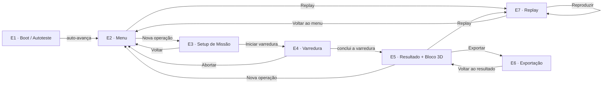

# Arquitetura de Informação e Fluxos (Fase 1) — GSFS Virtual

**Projeto:** GSFS Virtual — Simulador Técnico-Institucional
**Documento:** Arquitetura de informação, fluxos e wireframes de baixa fidelidade (entregável da Fase 1)
**Versão:** 1.1 *(aprovada pelo cliente em 05/06/2026; D-015 validado e D-017 — replay enriquecido — incorporado)*
**Data:** 03/06/2026 · **Aprovação do cliente:** 05/06/2026
**Responsável Técnico:** Jonathan — Result
**Referências normativas:**
- PRD GSFS Virtual v0.3 (19/05/2026)
- Matriz Narrativa dos 5 Cenários v0.2 · Roteiro Técnico v0.2
- Teto de Métricas v1.0 · Layout de Exportação v0.1
- Decisões [D-014] (prototipar em código), [D-015], [D-016]

---

## 1. Objetivo do documento

Cumprir o marco da **Fase 1 do Cronograma** — *"definir fluxos de navegação completos e estrutura de cada tela em baixa fidelidade"* — entregando:

1. o **mapa de fluxos** completo da jornada (boot → setup → varredura → resultado → replay → exportação);
2. os **wireframes de baixa fidelidade** de cada tela do PRD;
3. a definição de **transições, estados e variações**;
4. a **documentação das interações principais** para guiar a Fase 3.

Por decisão **[D-014]**, os wireframes não são telas estáticas em ferramenta de design: vivem como um **protótipo navegável em código** (a mesma stack da Fase 3), em **modo cinza/estrutural** de propósito. Este documento é a referência textual normativa que acompanha esse protótipo.

---

## 2. Onde está o protótipo (artefato da Fase 1)

Aplicação **`app/`** (React + Vite + TypeScript + React Router), estruturada como **portal de review**:

```
npm install --prefix app
npm run dev --prefix app      → http://localhost:5173
```

| Rota | Conteúdo |
|---|---|
| `/` | **Hub** — portal de review (Wireframes · UI Kit · Protótipo) |
| `/wireframe` | Índice das 7 etapas |
| `/wireframe/e1-boot` … `/e7-replay` | As 7 telas (ver §4) |
| `/ui-kit` | Placeholder — **Fase 2** |
| `/prototype` | Placeholder — **Fase 3** (é o produto entregue ao cliente) |

O Hub, `/wireframe` e `/ui-kit` são **ferramentas internas de review**; o produto final é o `/prototype` (Fase 3), que roda standalone. Referência de tela: **tablet 1280×800 landscape**, responsivo (container queries).

---

## 3. Mapa de fluxos (jornada)

A jornada tem **7 etapas** (a antiga E6 "Bloco 3D" foi absorvida pela E5 — ver [D-016]):



Ciclo do PRD coberto: **boot → setup → varredura → resultado → exportação → replay**.

---

## 4. Inventário de telas

Para cada etapa: rota, origem no PRD, propósito, blocos, **estados/variações**, transições.

### E1 — Boot / Autoteste · `/wireframe/e1-boot`
- **PRD:** 5.1. **Propósito:** inicialização do painel industrial + autoteste sequencial (referência estrutural enviada pelo cliente).
- **Estados:**
  - **E1a · Carregando (splash):** tela cheia **sem header/rodapé** — logo, tagline, "INICIALIZANDO NÚCLEO GSFS", barra de carregamento, legenda.
  - **E1b · Diagnóstico + Telemetria:** header/rodapé presentes. Painel esquerdo *Diagnóstico de Inicialização* — 12 verificações em 2 colunas, estados `WAIT → TEST → OK`, **todos os itens com altura uniforme**, conteúdo centralizado. Painel direito *Telemetria de Boot* — radar/scope + 6 tiles (bateria, temp., sinal, memória, bus, fusão). Faixa inferior *Progresso Geral*.
- **Determinístico:** todos os módulos terminam `OK` (sem estado de erro — ruído/CA-06 é só na E4).
- **Transições:** auto-avança → **E2** ao concluir o diagnóstico.

### E2 — Menu / Início · `/wireframe/e2-menu`
- **PRD:** ponto de entrada (não explícito no PRD). **Propósito:** lançador do apresentador após o boot.
- **Blocos:** logo, "GSFS VIRTUAL", dois cartões — **01 Nova Operação**, **02 Replay** — e faixa de status (sistema/bateria/sensores/GNSS).
- **Transições:** Nova Operação → **E3**; Replay → **E7**; ← Início → Hub.

### E3 — Setup de Missão · `/wireframe/e3-setup`
- **PRD:** 5.2 + 5.6. **Propósito:** configurar e iniciar a operação; escolher o cenário.
- **Controles (PRD 5.2):** select de **Cenário** (default "Nova configuração (manual)"); **Tipo de solo** (Rochoso/Arenoso/Úmido); **Modalidade** (Carrinho Autônomo/Mochila/Manual); **Área de varredura**.
- **Estados:**
  - **Manual ("Nova configuração"):** controles **manipuláveis** — solo/modalidade selecionáveis; área **híbrida** (campos livres `X × Y` + atalhos 10×10/15×15/20×20/25×25). **Iniciar desabilitado**: o modo manual é demonstrativo e **não executa** (só os 5 cenários determinísticos rodam).
  - **Cenário selecionado:** solo/modalidade/área **travados** no valor do cenário. Solo destaca a(s) base(s) canônica(s) com legenda do detalhe (**C4** → Rochoso *· com ruído eletromagnético*; **C5** → Arenoso + Úmido *· transicional*, conforme cobertura da Matriz §5).
- **Painel "Contexto da operação":** Data, Hora (relógio real — PRD §6), Coordenadas GNSS (4 casas — Teto §3.5), Posicionamento (FIX · satélites), Operação (aplicação do cenário) e mapa de posição. Labels em uppercase.
- **Anti-spoiler:** o setup **não exibe alvos** (alvos pertencem à detecção, 5.4).
- **Transições:** ← Voltar ao menu → **E2**; Iniciar varredura → **E4** (habilitado só com um cenário).

### E4 — Varredura · `/wireframe/e4-scan`
- **PRD:** 5.3 + 5.4 + Pilares 2/3; CA-06. **Propósito:** execução da varredura.
- **Estrutura (componente `ScanView`, reutilizado no Replay):** **HUD persistente** (progresso, relógio, bateria, temperatura, GNSS — labels uppercase + valores) com gap amplo entre os 3 grupos; **4 painéis de sensor em grade 2×2** (GPR/EMI/IMU/GNSS-RTK); **rail** com *Detecções* e *Log de Missão*.
- **Estados de cena (snapshots representativos):**
  - **Varrendo** (C1 ~55%): uma detecção já no feed (Magnetita).
  - **Detecção (alerta)** (C1 ~67%): barra de **alerta de detecção** "DETECÇÃO · OURO" (PRD 5.4), marcador no GPR, Ouro entra no feed (profundidade + ângulo).
  - **C4 Interferência** (CA-06): EMI `RUÍDO ALTO`, GPR `zona de degradação · baixa confiança`, dois falsos-ecos **descartados**, Ouro **confirmado** por fusão, linha *Fusão Multimodal*.
- **Ações da operação ([D-015], proposta Result):** **aba flutuante "AÇÕES"** na borda direita (centro vertical) → **sheet** com **Reiniciar** e **Abortar**, **ambos com confirmação**. Reiniciar → recomeça em `t=0`; Abortar → encerra **sem gerar GSFS_RECORD** → E2. Estado de review extra: *Menu de ações*.
- **Anti-spoiler:** o feed só mostra o que **já brotou**; a animação real da timeline é Fase 3.
- **Transições:** Abortar → **E2**; conclusão da varredura → **E5**.

### E5 — Resultado + Bloco 3D · `/wireframe/e5-result`
- **PRD:** 5.5 + Pilares 3/4. **Propósito:** fechamento da operação. Absorve a antiga E6 "Bloco 3D" ([D-016]).
- **Estados:**
  - **Consolidando** (Roteiro F3): volume agregado calculado, hash SHA-256 gerado, cadeia de custódia selando, barra 100%.
  - **Resultado:** viewport do **Bloco 3D em 1ª pessoa** (placeholder do vídeo Guarasoft) + **legenda "Registro da operação"** — Data, Hora, Volume cúbico, **Ativos identificados** (profundidade/ângulo), **GSFS_RECORD** ID, **Hash SHA-256**. Formatos seguem o Teto de Métricas.
- **Ações:** Nova operação → **E2**; Replay → **E7**; Exportar → **E6**.

### E6 — Exportação · `/wireframe/e6-export`
- **PRD:** Pilar 4; Layout de Exportação ([D-007]/[D-008]). **Propósito:** gerar os artefatos simbólicos.
- **Estados (toggle):**
  - **Formatos:** três cards — PDF (Relatório Técnico), GIS (Pacote Geoespacial), BIM (Pacote Construtivo); botão grande **← Voltar ao resultado** (→ E5).
  - **PDF:** pré-visualização das **5 páginas** (capa, sumário, mapa, alvos, cadeia de custódia) com marca d'água "SIMULAÇÃO" + **disclaimer** (CA-08); toolbar (← Formatos · Exportar arquivo).
  - **GIS / BIM:** **árvore de arquivos** do pacote + metadados (WGS84/EPSG:4326 simbólicos para GIS; profundidade/volume para BIM) + **disclaimer** próprio.
- **Sem download real** ([D-008]); **disclaimer obrigatório** (CA-08) presente nos previews.

### E7 — Replay · `/wireframe/e7-replay`
- **PRD:** CA-07 + Pilar 4. **Propósito:** listar gravações e reproduzir de forma determinística.
- **Estados (toggle):**
  - **Listagem:** 5 gravações (cenário · data/hora · duração · nº de alvos · ID) com **Reproduzir** / **Exportar**; botão grande **← Voltar ao menu** (→ E2).
  - **Replay:** **espelha a tela de varredura** (mesmo `ScanView`) + selo **"MODO REPLAY"** + **barra de controle** (⏮ ⏸ ⏭ · scrubber · tempo · 1×). Aba flutuante **"VOLTAR"** na borda **esquerda** → volta à listagem.
- **Dados da missão no replay ([D-017], feedback do cliente):** o replay não é "apenas imagens" — expõe explicitamente **linha do tempo, cenário executado, sensores ativos, timestamps, detecções confirmadas, falsos positivos descartados** (quando houver) e **referência ao GSFS_RECORD / hash**. Reforça rastreabilidade, repetibilidade e credibilidade institucional (CA-07 / Pilar 4). Os metadados (cenário, GSFS_RECORD/hash, linha do tempo) entram como overlay sobre o `ScanView`; comportamento dinâmico do scrubber é Fase 3.
- **Bloco 3D ao final do replay ([D-020], Fase 3):** ao concluir a reprodução da varredura, a E7 **apresenta o mesmo bloco/vídeo 3D de resultado da E5**, espelhando o fluxo da missão real (varredura → resultado 3D). Reaproveita o ativo da E5 (nenhum vídeo novo) e atende ao pedido do cliente de rever o 3D no Replay, sem ferir o CA-07 (a varredura segue reproduzida de forma determinística e idêntica).

---

## 5. Padrões transversais

- **Modo wireframe:** cinza/estrutural escopado (`.wf`), **sem cor de marca, tipografia final ou ícones** — isso é Fase 2 (UI Kit). Cada tela traz a faixa "[ faixa de identidade visual — Fase 2 ]".
- **Casca `WfScreen`:** "tablet" 1280×800 com barra superior (logo · título · meta) e rodapé padronizados; modo `bare` (sem topbar/rodapé) para a splash da E1.
- **`ScanView` reutilizável:** corpo da varredura compartilhado por E4 e E7 (garante que o Replay seja **idêntico** à varredura — CA-07).
- **Navegação tátil (tablet):** botões de voltar **grandes** (padrão "← Voltar…"); **abas flutuantes** na borda — "AÇÕES" (E4, direita, abre sheet) e "VOLTAR" (E7 replay, esquerda, volta direto).
- **Confirmações:** ações destrutivas/irreversíveis (Reiniciar, Abortar) passam por **modal de confirmação**.
- **Anti-spoiler:** nenhuma tela pré-varredura/durante-varredura revela alvos antes da detecção correspondente.
- **Métricas:** todas seguem o **Teto de Métricas v1.0** (formatos, arredondamento, sem métrica proibida).

---

## 6. Cobertura cruzada com o PRD

| Requisito do PRD | Onde é atendido |
|---|---|
| 5.1 Boot e autoteste | **E1** |
| 5.2 Configuração de missão (solo/área/modalidade/cenário) | **E3** |
| 5.3 Execução da varredura (4 painéis + persistentes) | **E4** |
| 5.4 Detecção e classificação (alerta + rótulo + profundidade/ângulo) | **E4** (estado Detecção) |
| 5.5 Resultado + bloco 3D 1ª pessoa + legenda | **E5** |
| 5.6 Biblioteca de 5 cenários determinísticos | **E3** (select) |
| Pilar 2 — HUD / telemetria / GNSS | **E1** (telemetria), **E4** (HUD) |
| Pilar 3 — fusão multimodal / cadeia de custódia | **E4** (C4), **E5** (hash) |
| Pilar 4 — log, GSFS_RECORD, replay, exportação | **E4** (log), **E5** (record), **E7** (replay), **E6** (exportação) |
| CA-06 — ruído/interferência | **E4** (estado C4) |
| CA-07 — replay determinístico | **E7** |
| CA-08 — sem claims fechados (disclaimer) | **E6** (disclaimers nos previews) |
| §6 — reatividades (relógio/bateria) | slots presentes em E1/E3/E4 (comportamento dinâmico = Fase 3) |
| Teto de Métricas v1.0 | todas as telas |

**Fronteira de fase:** comportamento dinâmico real (relógio/bateria ao vivo, animação da timeline, render 3D) é **Fase 3**; cor/tipografia/componentes são **Fase 2**. A Fase 1 entrega **estrutura, fluxos e estados**.

---

## 7. Decisões da Fase 1

Detalhe e rastreabilidade no [Decision Log](Decisoes_GSFS_Virtual.md).

- **[D-014]** — Prototipar a Fase 1 em **código** (portal de review), em vez de wireframes no Figma.
- **[D-015]** — **Abortar / Reiniciar** a varredura com confirmação (aba "AÇÕES" + sheet) — **validado pelo cliente em 05/06** (que reforçou a exigência de confirmação antes de encerrar/reiniciar).
- **[D-016]** — **Jornada de 7 etapas**: fusão de Resultado + Bloco 3D numa só tela (PRD 5.5) e select de cenário com **"Nova configuração" manual demonstrativa** (não-funcional) + **área híbrida** (livre, conforme leitura do PRD 5.2).
- **[D-017]** — **Replay enriquecido com dados da missão** (E7): linha do tempo, cenário, sensores ativos, timestamps, detecções confirmadas, falsos positivos descartados e GSFS_RECORD/hash — **feedback do cliente (05/06)**.

---

## 8. Itens a validar com o cliente / pendências

- ✅ **[D-015]** Abortar/Reiniciar — **validado pelo cliente em 05/06** (reforçada a exigência de confirmação antes de encerrar/reiniciar a missão).
- ✅ **Replay com dados da missão** — solicitado pelo cliente em 05/06 → incorporado como **[D-017]** (E7).
- ✅ **"Nova configuração (manual)"** — permanece **demonstrativa** (não-funcional): apenas os 5 cenários determinísticos executam. Decisão Result consolidada ([D-016]); sem necessidade de validação adicional do cliente.
- **Observações de continuidade registradas pelo cliente (05/06):** (1) aplicar a **identidade visual** aprovada na próxima etapa (logo, paleta, tipografia, tema escuro); (2) **Cenário 5** permanece premium/proprietário (5 atributos GSFS — D-011); (3) métricas alinhadas ao **Teto de Métricas v1.0**; (4) exportação PDF/GIS/BIM **simbólica/demonstrativa** (D-008/CA-08).
- **Insumos das próximas fases:** identidade visual aplicada (Fase 2 / UI Kit); vídeos 3D da Guarasoft e specs técnicas do cliente (Fase 4); comportamento dinâmico/determinístico ao vivo (Fase 3).

---

## 9. Marco de saída

✅ **Wireframes cobrindo todos os fluxos do PRD** (7 etapas, com estados e transições), em protótipo navegável (`app/`), aderente ao PRD v0.3 e ao Teto de Métricas v1.0.

Aprovado internamente (Result) em 03/06/2026 e **aprovado pelo cliente em 05/06/2026** ("considero a Fase 1 aprovada para continuidade"), com [D-015] validado e duas observações incorporadas: **[D-017]** (replay com dados da missão) e as quatro notas de continuidade para a Fase 2 (§8). **Fase 1 encerrada.** Este documento é referência normativa para o **UI Kit (Fase 2)** e a **implementação de alta fidelidade (Fase 3)**.
